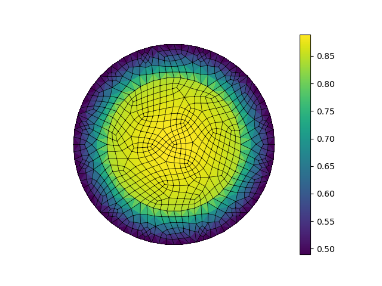

.. _insulated:

Insulated wire
--------------

.. note::
   This example requires the external package `pygmsh <https://pypi.org/project/pygmsh/>`_.
   
This example solves the steady heat conduction
with generation in an insulated wire. In radial
coordinates, the governing equations read: find :math:`T`
satisfying

.. math::
   \nabla \cdot (k_0 \nabla T) + A = 0, \quad 0<r<a,

and

.. math::
   \nabla \cdot (k_1 \nabla T) = 0, \quad a<r<b,

with the boundary condition

.. math::
   k_1 \frac{\partial T}{\partial r} + h T = 0, \quad \text{on $r=b$}.

The parameter values are :math:`k_0 = 101`, :math:`k_1 = 11`, :math:`A = 5`,
:math:`h = 7`, and the geometry is defined as :math:`a=2` and :math:`b=3`.

For comparison purposes, the exact solution at the origin is

.. math::
   T(r=0) = \frac{A b^2}{4 k_0} \left( \frac{2k_0}{bh} + \frac{2 k_0}{k_1} \log \frac{b}{a} + 1\right).

   The visualised solution of example 17.
   
.. literalinclude:: ex17.py
   :linenos:
