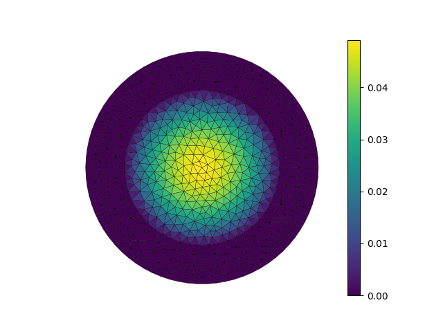

.. _subdomain:

Restricting a problem to a subdomain
------------------------------------

.. note::
   This example requires the external package `pygmsh <https://pypi.org/project/pygmsh/>`_.

The :ref:`insulated` example solved the steady-state heat equation with uniform volumetric heating in a central wire surrounded by an annular insulating layer of lower thermal conductivity.  Here, the problem is completely restricted to the wire, taking the temperature as zero throughout the annulus.

Thus the problem reduces to the same Poisson equation with uniform forcing and homogeneous Dirichlet conditions as in the example on :ref:`postprocess`

.. math::
   \nabla\cdot(k\nabla T) + A  = 0, \qquad 0 < r < a

with

.. math::
   T = 0, \qquad\text{on}\quad r = a.

The exact solution is

.. math::
   T = \frac{s}{4k}(a^2 - r^2).

The novelty here is that the temperature is defined as a finite element function throughout the mesh (:math:`r < b`) but only solved on a subdomain.

This can be done using the same technique with which Dirichlet conditions are applied: `condense`, specifying that the all the degrees of freedom belonging to the surrounding annular subdomain are constrained.

.. literalinclude:: ex26.py
   :start-at: unique
   :end-at: D=insulation

Note that 'wire' here does not include all the degrees of freedom associated with the subdomain of that name; as it is defined as the complement of the 'insulated' subdomain, those on the interface are excluded.  This is effectively imposing zero-temperature boundary conditions on the wire.

    The temperature field throughout the wire and surrounding cold annulus.

The complete source code reads as follows:

.. literalinclude:: ex26.py
    :linenos:
