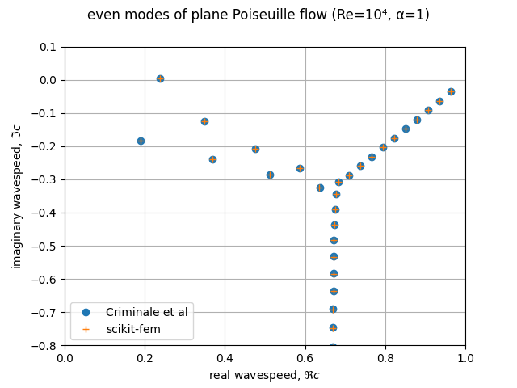

Linear hydrodynamic stability
-----------------------------

The linear stability of one-dimensional solutions of the Navier–Stokes equations is governed by the `Orr–Sommerfeld equation <https://en.wikipedia.org/wiki/Orr%E2%80%93Sommerfeld_equation>`_ (Drazin & Reid 2004, p. 156).  This is expressed in terms of the stream-function :math:`\phi` of the perturbation, giving a two-point boundary value problem

.. math::

   \alpha\phi(\pm 1) = \phi'(\pm 1) = 0

for a complex fourth-order ordinary differential equation,

.. math::

   \left(\alpha^2-\frac{\mathrm d^2}{\mathrm dz^2}\right)^2\phi
   = (\mathrm j\alpha R)\left\{
     (c - U)\left(\alpha^2-\frac{\mathrm d^2}{\mathrm dz^2}\right)\phi
     - U''\phi,
   \right\}

where :math:`U(z)` is the base velocity profile, :math:`c` and :math:`\alpha` are the wavespeed and wavenumber of the disturbance, and :math:`R` is the Reynolds number.  In the 'temporal' stability problem, :math:`R` and :math:`\alpha` are specified as positive and :math:`c` found as the complex eigenvalue.
   
The fourth-order derivatives would require :math:`C^1` finite elements, e.g. of the Hermite family (Mamou & Khalid 2004); however, this can be avoided by reverting to the system from which the Orr–Sommerfeld stream-function equation is derived (Drazin & Reid 2004, eq. 25.9, p. 155), which is expressed in terms of pressure :math:`p` and longitudinal :math:`u` and transverse :math:`w` components of the disturbance to the velocity:  

.. math::
   
   \left(\mathrm j\alpha R U(z) + \alpha^2 - \frac{\mathrm d^2}{\mathrm dz^2}\right)u + RU'(z)w + \mathrm j\alpha  Rp &= \mathrm j\alpha Rc u \\
   \left(\mathrm j\alpha R U(z) + \alpha^2 - \frac{\mathrm d^2}{\mathrm dz^2}\right)w + R\frac{\mathrm dp}{\mathrm dz} &= \mathrm j\alpha Rc w \\
   \mathrm j\alpha R u + R\;\frac{\mathrm dw}{\mathrm dz} &= 0
   
This primitive system is second-order and can be discretized using one-dimensional Taylor–Hood elements, analogous to the two-dimensional elements used for the :ref:`stokesex` and :ref:`navierstokes`.

The classical test-case for this problem is plane Poiseuille flow :math:`U(z) = 1 - z^2` on :math:`-1 < z < 1` at :math:`\alpha = 1` and :math:`R = 10^4` (Drazin & Reid 2004, figure 4.19; Mamou & Khalid 2004), typically seeking only the 'even' modes for which :math:`u(0) = u(1) = w'(0) = w(1) = 0`.  Good agreement with reference results for the complex wavespeed spectrum  (Criminale, Jackson, & Joslin 2003, table 3.1) is obtained on a uniform mesh of 64 segments.

    The spectrum of 'even'-mode complex wavespeeds for plane Poiseuille flow at Re = 10 000 and :math:`\alpha = 1` (cf. Criminale, Jackson, & Joslin 2003, table 3.1; Drazin & Reid 2004, figure 4.19)

.. literalinclude:: ex29.py
   :linenos:

* Criminale, W. O., Jackson, T. L.,, Joslin, R. D. (2003). *Theory and Computation in Hydrodynamic Stability.* Cambridge: Cambridge University Press. `doi:10.1017/CBO9780511550317 <https://doi.org/10.1017%2fCBO9780511550317>`_
*  Drazin, P. G., Reid, W. H. (2004). *Hydrodynamic Stability.* Cambridge University Press. `doi:10.1017/CBO9780511616938 <https://doi.org/10.1017%2fCBO9780511616938>`_
*  Mamou, M. & Khalid, M. (2004). Finite element solution of the Orr–Sommerfeld equation using high precision Hermite elements: plane Poiseuille flow. *International Journal for Numerical Methods in Fluids* 44. pp. 721–735. `doi:10.1002/fld.661 <https://doi.org/10.1002%2ffld.661>`_
