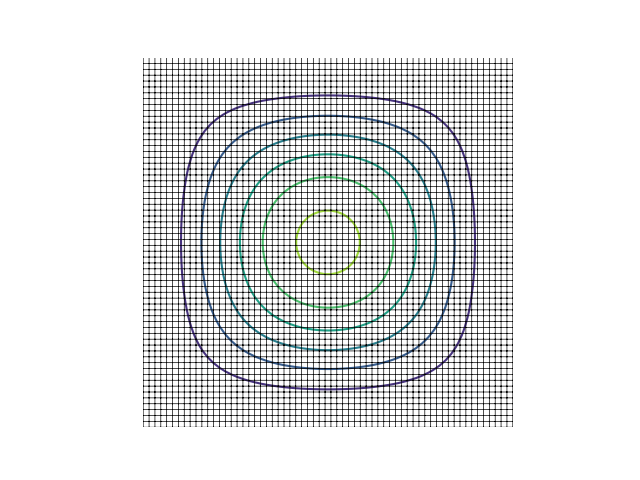

.. _uzawa:

Krylov–Uzawa method for the Stokes equation
-------------------------------------------

This example solves :ref:`stokesex` iteratively in a square domain.

Direct solvers for the Stokes equation do not scale; iterative solvers are required for all but the smallest two-dimensional problems.  A square domain is used here instead of the disk since it easier to generate the finer mesh required to demonstrate the time taken for a slightly larger problem.

A classical iterative procedure for the Stokes equation is the Uzawa congugate gradient method in which an auxiliary operator is formed which maps a guessed pressure field to the divergence of the velocity field which satisfies the momentum equation with that pressure [GLOWINSKI-PIRONNEAU]_
[BRAESS]_.

.. math::
    \nu\Delta\boldsymbol{u} = -\rho^{-1}\nabla p + \boldsymbol{f}

This operator is affine but subtracting the divergence given by zero pressure gives a linear operator which can be solved by a Krylov method, classically the method of conjugate gradients.

At each iteration, the above vector Poisson equation is solved for a velocity field.  As the problem gets larger, this too should be solved iteratively.  The method of conjugate gradients could be used for this too, but a catch is that :func:scipy.sparse.linalg.cg is not re-entrant can so cannot be used at both levels.  This is simply avoided here by using :func:scipy.sparse.linalg.minres for the pressure.

	    The stream-lines in a small horizontally heated square cavity.

The results may be assessed using the value of the stream-function at the centre.  As in :ref:`biharmonic`, the stream-function satisfies the same boundary value problem as the deflection of a clamped plate, for which the central deflection is known to be approximately 0.162/128 [LOVE]_.
	    
.. [BRAESS] Braess, D. (2001). *Finite Elements.* Cambridge University Press, §IV.5.1
  
.. [GLOWINSKI-PIRONNEAU] Glowinski, R. & Pironneau, O. (1979). On numerical methods for the Stokes problem. In R. Glowinski, E. Y. Rodin & O. C. Zienkiewicz (eds.), *Energy Methods in Finite Element Analysis* (pp. 243–264), Wiley

.. [LOVE] Love, A. E. H. (1944). *A Treatise on the Mathematical Theory of Elasticity.* Dover

.. literalinclude:: ex30.py
   :linenos:
