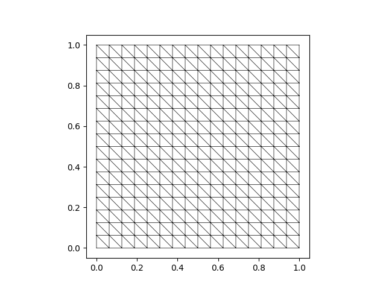

Poisson equation
----------------

The canonical model problem for second-order partial
differential equations reads: find :math:`u : \Omega \rightarrow \mathbb{R}`
that satisfies

.. math::
    \begin{aligned}
        -\Delta u &= f, && \text{in $\Omega$},\\
        u &= 0, && \text{on $\partial \Omega$},
    \end{aligned}

where :math:`\Omega = (0,1)^2` and :math:`f` is the loading.  This simple model
problem and its variants have applications, e.g., in `electrostatics
<https://en.wikipedia.org/wiki/Laplace%27s_equation#Electrostatics_2>`_,
`acoustics <https://en.wikipedia.org/wiki/Helmholtz_equation>`_ and `fluid flow
<https://en.wikipedia.org/wiki/Potential_flow#Analysis_for_two-dimensional_flow>`_.

In this example, we solve the problem using piecewise-linear triangular finite
elements. A square domain can be meshed using the default constructor of
:class:`MeshTri`. In the following, the default mesh is further refined four
times:

.. literalinclude:: ../examples/ex01.py
    :lines: 1-4

    The generated mesh of the unit square.

Next, we pre-evaluate the finite element basis at the global quadrature
points. This is done by creating an object of the type :class:`InteriorBasis`
whose constructor requires the mesh and an :class:`Element` object:

.. literalinclude:: ../examples/ex01.py
    :lines: 6-7

The weak formulation corresponding to our problem reads:
find :math:`u \in H^1_0(\Omega)` that satisfies

.. math::
    (\nabla u, \nabla v) = (f, v), \quad \forall v \in H^1_0(\Omega).

The respective bilinear and linear forms can be defined with the help of the
decorators called `@bilinear_form` and `@linear_form`. It is important to have
the order of the form arguments correct.

.. literalinclude:: ../examples/ex01.py
    :lines: 9-15

All assembly operations are performed by the function :meth:`asm`. It needs the
form function handle and a pre-evaluated basis as its arguments.

.. literalinclude:: ../examples/ex01.py
    :lines: 17-18
