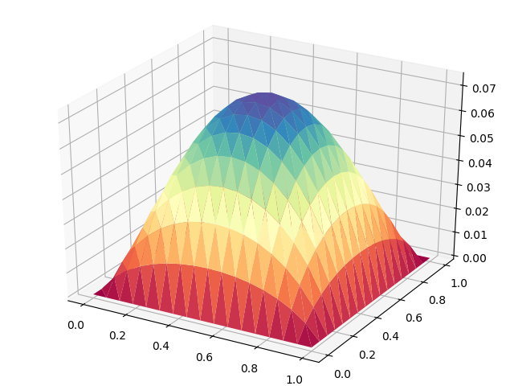

Poisson equation
----------------

In this example, we demonstrate the basic concepts
and workflow of scikit-fem. This is done by solving
the canonical model problem for second-order partial
differential equations: find :math:`u : \Omega \rightarrow \mathbb{R}`
that satisfies

.. math::
    \begin{aligned}
        -\Delta u &= f, && \text{in $\Omega$},\\
        u &= 0, && \text{on $\partial \Omega$},
    \end{aligned}

where :math:`\Omega = (0,1)^2` and :math:`f` is the loading.  This simple model
problem and its variants have applications, e.g., in `electrostatics
<https://en.wikipedia.org/wiki/Laplace%27s_equation#Electrostatics_2>`_,
`acoustics <https://en.wikipedia.org/wiki/Helmholtz_equation>`_ and `fluid flow
<https://en.wikipedia.org/wiki/Potential_flow#Analysis_for_two-dimensional_flow>`_.
Finite element method can be used for solving the problem's weak formulation:
find :math:`u \in H^1_0(\Omega)` that satisfies

.. math::
    (\nabla u, \nabla v) = (f, v)  \quad \forall v \in H^1_0(\Omega).

We discretise this problem using piecewise-linear triangular finite elements.  A
mesh for the unit square can be obtained using the default constructor of
:class:`~skfem.mesh.MeshTri`.  In the following, we further refine the default mesh four
times:

.. literalinclude:: ../examples/ex01.py
    :lines: 1-4

.. figure:: ../examples/ex01_mesh.png

    The resulting mesh of the unit square. Triangular meshes can be
    visualised using :meth:`~skfem.mesh.MeshTri.draw`.

After creating the mesh, we evaluate the finite element basis at the global
quadrature points. This is done within an object of the type
:class:`~skfem.assembly.InteriorBasis` whose constructor requires the mesh and an
:class:`~skfem.element.Element` object:

.. literalinclude:: ../examples/ex01.py
    :lines: 6-7

The class :class:`~skfem.element.ElementTriP1` is a child of :class:`~skfem.element.Element` and it defines
the local basis functions and transformation rules.

The bilinear and linear forms can be defined using the decorators
:func:`~skfem.assembly.bilinear_form` and :func:`~skfem.assembly.linear_form`. It is important to have the order of the
form arguments correct.

.. literalinclude:: ../examples/ex01.py
    :lines: 9-15

All assembly operations can now be performed with the function :func:`~skfem.assembly.asm`
which returns either SciPy sparse matrices or NumPy vectors depending on the
input.

.. literalinclude:: ../examples/ex01.py
    :lines: 17-18

We are left with solving assembler linear system.  Due to the zero boundary
condition, we do this only in the interior nodes of the mesh.

.. literalinclude:: ../examples/ex01.py
    :lines: 20-23

The solution can now be visualised using :meth:`~skfem.mesh.MeshTri.plot3`. 

    The visualised solution of example 1.

The complete source code reads as follows:

.. literalinclude:: ../examples/ex01.py
    :linenos:
