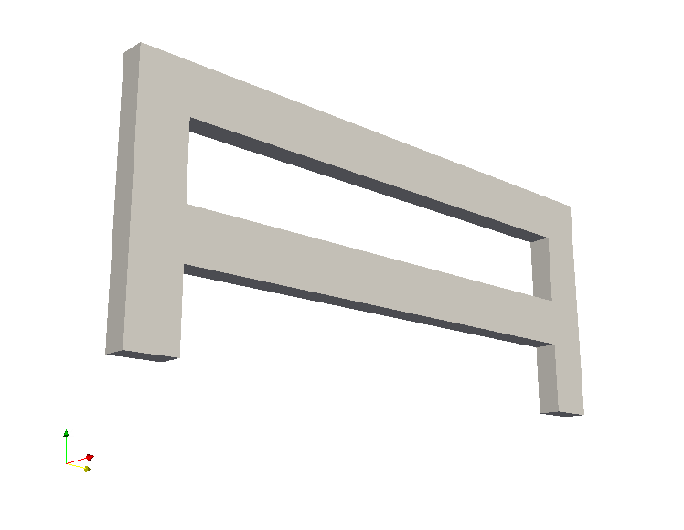

Structural vibration
--------------------

This example demonstrates the solution of a three-dimensional
vector-valued problem. For this purpose, we consider the elastic
eigenvalue problem.

	    The elastic structure
	    denoted by :math:`\Omega`.
	    The bottom boundaries, fixed to the ground,
	    are denoted by :math:`\Gamma_D`. The rest of the
	    boundary is denoted by :math:`\Gamma_N`.

The governing equation of an elastic structure reads: find
:math:`\boldsymbol{u} : \Omega \rightarrow \mathbb{R}^3` satisfying

.. math::
   \rho \ddot{\boldsymbol{u}} = \mathrm{div}\,\boldsymbol{\sigma}(\boldsymbol{u}) + \rho \boldsymbol{g},

where :math:`\rho = 8050\,\frac{\mathrm{kg}}{\mathrm{m}^3}` is the density. We consider two kinds of boundary conditions. On a *fixed part* of the boundary, :math:`\Gamma_D \subset \partial \Omega`, the displacement field :math:`\boldsymbol{u}` satisfies

.. math::
   \boldsymbol{u}|_{\Gamma_D} = \boldsymbol{0}.

Moreover, on a *free part* of the boundary, :math:`\Gamma_N = \partial \Omega \setminus \Gamma_D`, the *traction vector* :math:`\boldsymbol{\sigma}(\boldsymbol{u})\boldsymbol{n}` satisfies

.. math::
   \boldsymbol{\sigma}(\boldsymbol{u})\boldsymbol{n} \cdot \boldsymbol{n}|_{\Gamma_N} = 0,

where :math:`\boldsymbol{n}` denotes the outward normal.

Neglecting the gravitational acceleration :math:`\boldsymbol{g}` and
assuming a periodic solution of the form

.. math::
   \boldsymbol{u}(\boldsymbol{x},t) = \boldsymbol{w}(\boldsymbol{x}) \sin \omega t,

leads to the following eigenvalue problem with :math:`(\boldsymbol{w},\omega)` as an unknown:

.. math::
   \mathrm{div}\,\boldsymbol{\sigma}(\boldsymbol{w}) = \rho \omega^2 \boldsymbol{w}.

The weak formulation of the problem reads: find :math:`(\boldsymbol{w},\omega) \in V \times \mathbb{R}` satisfying

.. math::
   (\boldsymbol{\sigma}(\boldsymbol{w}), \boldsymbol{\epsilon}(\boldsymbol{v})) = \rho \omega^2 (\boldsymbol{w}, \boldsymbol{v}), \quad \forall \boldsymbol{v} \in V,
